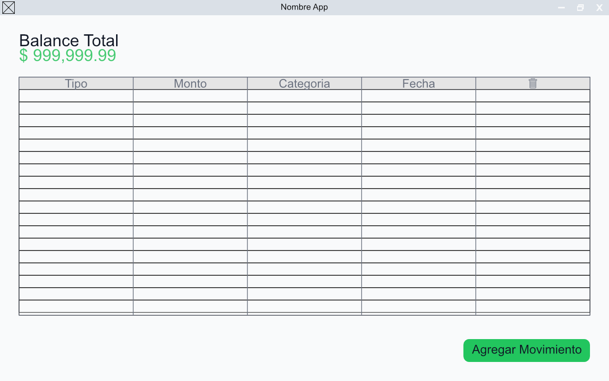
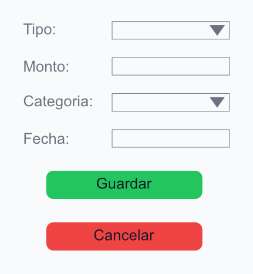

### 💰 Sistema de Finanzas Personales
# Financia

Aplicación de escritorio para la gestión de ingresos y egresos desarrollada con JavaFX y Spring.

---

## 🏷️ Tecnologías


---

## 📸 Vista general del sistema

_Pantalla principal_


<br>

_Modal para registro de nuevos movimientos_


---


## 🧾 Descripción

Aplicación de escritorio desarrollada en Java que permite gestionar de forma sencilla ingresos y egresos personales, ofreciendo una visualización clara del balance financiero en tiempo real.

El sistema está construido con JavaFX para la interfaz gráfica y Spring para la gestión de dependencias y la lógica de negocio, siguiendo una estructura organizada en controladores, servicios y modelos. Esto permite mantener un código escalable, entendible y preparado para futuras mejoras.

La aplicación permite registrar movimientos financieros mediante un formulario intuitivo, clasificarlos por tipo (ingreso o egreso) y categoría, así como visualizar todos los registros en una tabla dinámica donde pueden ser eliminados fácilmente. Cada acción impacta directamente en el cálculo del balance total, proporcionando retroalimentación inmediata al usuario.

---

## 🎯 Objetivo del proyecto

El objetivo de este proyecto es desarrollar una aplicación de escritorio enfocada en la gestión de finanzas personales, permitiendo registrar, visualizar y controlar ingresos y egresos de forma clara y eficiente.

Además de su funcionalidad, el proyecto busca servir como una base sólida para aplicar buenas prácticas de desarrollo de software, incluyendo separación de responsabilidades, uso de patrones de diseño y una arquitectura escalable. Forma parte de un proceso de aprendizaje continuo, donde cada versión del sistema incorporara mejoras tanto a nivel funcional como estructural.

---

## ⚙️ Tecnologías utilizadas

- Java
- JavaFX
- Spring

El sistema está construido con tecnologías enfocadas en aplicaciones de escritorio robustas y escalables.

---

## 🏗️ Arquitectura del sistema

El sistema está estructurado siguiendo una separación clara de responsabilidades:

- **Controladores:** gestionan la interacción con la interfaz gráfica.
- **Servicios:** contienen la lógica de negocio.
- **Modelos:** representan las entidades del sistema.

Esta organización permite desacoplar la lógica de la interfaz, facilitando futuras mejoras y escalabilidad.

Para entender a detalle cómo funciona el sistema, revisa la documentación completa:

- 🏗️ [Arquitectura del sistema](docs/arquitectura.md)
---

## 🧩 Funcionalidades principales

- Registro de movimientos (ingresos y egresos)
- Clasificación por categorías
- Visualización en tabla dinámica
- Eliminación de movimientos
- Cálculo automático del balance total
- Interfaz intuitiva con formularios

---

## 🧠 Decisiones de diseño relevantes

Durante el desarrollo se tomaron decisiones enfocadas en mantener un equilibrio entre funcionalidad y claridad del código:

- Se priorizó una implementación funcional en la primera versión, evitando sobreingeniería prematura.
- Se separaron responsabilidades dentro de los controladores mediante métodos específicos.
- Se implementaron utilidades reutilizables para mensajes y alertas.
- Se optó por representar los egresos como valores negativos para simplificar el cálculo del balance.

---

## 📈 Etapa actual del proyecto

**Versión V1.0.0:**
- Implementación funcional del sistema
- Registro y visualización de movimientos
- Cálculo de balance en tiempo real

**Versión V1.0.1 (planeada):**
- Separación de responsabilidades
- Refactorización de controladores

---

## 💡 Sobre el proyecto

Este proyecto forma parte de mi proceso de aprendizaje continuo en desarrollo de software, donde busco no solo crear aplicaciones funcionales, sino también mejorar continuamente la calidad del código, la arquitectura y las buenas prácticas de desarrollo.

---

## 🗄️ Configuración de la base de datos (H2)

El proyecto utiliza H2 Database como base de datos en archivo local.  
Puedes elegir dónde se almacenará la base de datos según tu necesidad.

---

### 📁 Opción 1: Base de datos en la carpeta del usuario (RECOMENDADO)

Guarda la base de datos en una ubicación persistente del sistema:

```properties
app.storage.path=${user.home}/Financia
spring.datasource.url=jdbc:h2:file:${app.storage.path}/financiaDB;AUTO_SERVER=TRUE;DB_CLOSE_ON_EXIT=FALSE
```

**Ventajas:**

- Los datos no se pierden al mover o eliminar el proyecto
- Ideal para uso real o distribución como .exe o .jar

### 📦 Opción 2: Base de datos en la carpeta del proyecto

Guarda la base de datos dentro del directorio del proyecto:

```properties
spring.datasource.url=jdbc:h2:file:./financiaDB;DB_CLOSE_ON_EXIT=FALSE;AUTO_RECONNECT=TRUE
```

**Ventajas:**

- Configuración rápida para desarrollo
- Útil para pruebas o entornos temporales

## ⚙️ ¿Cómo cambiar entre modos?

En el archivo application.properties:

### Para usar la carpeta del usuario:

Descomenta:

```properties
app.storage.path=${user.home}/Financia
spring.datasource.url=jdbc:h2:file:${app.storage.path}/financiaDB;AUTO_SERVER=TRUE;DB_CLOSE_ON_EXIT=FALSE
```


Comenta:

```properties
spring.datasource.url=jdbc:h2:file:./financiaDB;DB_CLOSE_ON_EXIT=FALSE;AUTO_RECONNECT=TRUE
```

### Para usar la carpeta del proyecto:

Descomenta:

```properties
spring.datasource.url=jdbc:h2:file:./financiaDB;DB_CLOSE_ON_EXIT=FALSE;AUTO_RECONNECT=TRUE
```

Comenta 
```properties
app.storage.path=${user.home}/Financia
spring.datasource.url=jdbc:h2:file:${app.storage.path}/financiaDB;AUTO_SERVER=TRUE;DB_CLOSE_ON_EXIT=FALSE
```

## ⚠️ Notas

Si utilizas la opción de carpeta del usuario, el sistema creará automáticamente el directorio `Financia` dentro de tu carpeta personal al iniciar la aplicación.


📄 Ver historial completo: [CHANGELOG.md](CHANGELOG.md)

Si quieres crear el instalador de la aplicacion para poder distribuirla con una version
embebida de la JVM lee [DEV_NOTES.md](docs/DEV_NOTES.md)