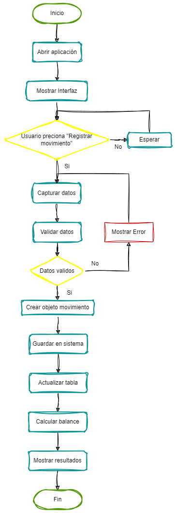

# 🏗️ Arquitectura del Sistema

## 📌 Visión general

El sistema **Financia** está diseñado como una aplicación de escritorio basada en una arquitectura por capas, con el objetivo de garantizar mantenibilidad, escalabilidad y claridad en la organización del código.

Se implementa una separación de responsabilidades que permite desacoplar la lógica de negocio de la interfaz gráfica, facilitando futuras mejoras y refactorizaciones.

---

## 🧱 Estructura general

La aplicación está organizada en tres capas principales:

- Controlador
- Servicio
- Modelo

---

## 🔄 Flujo de la aplicación

1. El usuario interactúa con la interfaz gráfica (JavaFX).
2. El controlador captura el evento.
3. El controlador delega la operación al servicio.
4. El servicio ejecuta la lógica de negocio.
5. El modelo representa y almacena los datos.
6. Se actualiza la interfaz con los nuevos valores.

---

## 📊 Diagrama de flujo

---

## 🧩 Capas del sistema

### 🎮 Controladores (Control)

Responsables de gestionar la interacción con la interfaz gráfica.

**Responsabilidades:**
- Manejo de eventos (botones, formularios)
- Validación básica de datos de entrada
- Comunicación con la capa de servicios

**Ejemplo:**
- Registro de movimientos
- Eliminación de registros
- Actualización de tablas

---

### ⚙️ Servicios (Servicio)

Contienen la lógica de negocio del sistema.

**Responsabilidades:**
- Procesamiento de datos
- Aplicación de reglas de negocio
- Coordinación entre componentes

**Ventajas:**
- Reutilización de lógica
- Facilidad de pruebas
- Bajo acoplamiento

---

### 🧾 Modelos (Model)

Representan las entidades del sistema.

**Responsabilidades:**
- Definición de estructuras de datos
- Representación de movimientos financieros
- Encapsulación de atributos

**Ejemplo:**
- Movimiento (tipo, monto, categoría, fecha)

---

## 🧠 Decisiones de arquitectura

Durante el desarrollo se tomaron las siguientes decisiones clave:

- Se optó por una arquitectura en capas para evitar acoplamiento entre interfaz y lógica de negocio. Aunque aun faltan por pulir varios puntos ya que esto es un MVP se planea para un siguiente version hacer un desacople mas claro.
- Se priorizó una implementación funcional inicial antes de aplicar patrones más complejos.
- Se diseñó el sistema pensando en una futura migración a un patrón MVC completo.
- Se procuro mantener la lógica de negocio fuera de los controladores para mejorar mantenibilidad.

---

## 🚀 Evolución de la arquitectura

### 🔹 Versión 1.0.0
- Implementación inicial funcional
- Lógica parcialmente acoplada a controladores

### 🔹 Versión 1.0.1 (en progreso)
- Separación de responsabilidades
- Refactorización de controladores

### 🔹 Versión 1.1.0 (planeada)
- Implementación formal del patrón MVC
- Mayor desacoplamiento entre capas

---

## 🔮 Escalabilidad futura

El sistema está preparado para evolucionar hacia:

- Implementación completa de MVC o MVVM
- Persistencia más robusta (JPA / Hibernate)
- Modularización del sistema
- Manejo de datos mas complejos

---

## 📌 Conclusión

La arquitectura actual proporciona una base sólida para el crecimiento del sistema, permitiendo iterar sobre el diseño sin comprometer la estabilidad ni la claridad del código.

El enfoque adoptado prioriza la evolución progresiva, evitando sobreingeniería en etapas tempranas mientras se mantiene una dirección clara hacia buenas prácticas de desarrollo de software.